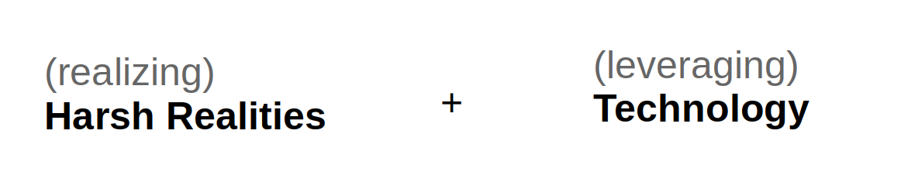

* Two key words from Ray Dalio's __Principles__ \
    * Realizing harsh realities will improve your attitude toward situations around you 
    * Invest in Tech, learn and use Tech, and be at the forefront of Tech \
    {width=300}
* Reduce errors to accomplish faster
* Read, do not interpret 
* __Slower__ speaking / reading / swing
* __80/20__ Don't be a perfectionist; Be efficient
* Don't be a programmer nor an engineer \
  Be an innovator / entrepreneur / leader who uses technologies
* __Make a right decision__ based on the best opinions, which do not only need to be coming from yourself
* Observe yourself from above, and meditate
* Don't be regretful __once the decisions are made__ 
  There is no such thing or decision that would have been much better anyway
* Be __true__ to myself
* Build a lifetime plan for the next 40 years and execute the plan
* Do not pay any attention to what others say; their views are shallow anyway
* __Own the room__ (from Mads)
* Create value and make impact 
  Use 2yrs for my passion
* Don't think about the same thing twice
* Forgive people; things
  Look at yourself; you are spending your emotion and energy at something meaningless
  Pride or self-esteem are not meaningful
* The next 40 years, there will be tremendous changes in all areas of society/culture/economics/technology... Be at the forefront
* Manage your subconscious, which is the product of evolution
    * Understand our brains
    * Humankind has evolved as a entirety, not as a individual; individual has much less meaning

### From Youtube, Rick Rigsby
* It's better to be an hour early than a minute late 
* You are what you repeatedly do (Aristotle)
* Be kind to everyone, don't embarrass mother
* Make your servant's towel bigger than yours
* Pride is the burden of the foolish person
* Find your broom 
* Do it right 
* Good enough is not good enough, if you can be better 
* You keep standing 
* It's never wrong to do a right thing

### From Steve Jobs, Standford commencement
1. Connecting the dots
    - Colleage drop-out and getting fired by Apple were the best things that happened
    - You can only connect dots looking backward
    - Awful tasting medicine is good for health
2. Following the passion 
    - "I found it fascinating"
    - You must have the trust and courage to follow your passion, and the dots will be connected eventually
    - You got to find what you love
    - Keep looking / don't settle
    - Life is likely to be filled by what you do
3. Death / priorities / find meaning
    - You will die
    - Ask yourself what you do today is meaningful 
    - Death is the very likely single the most important invention of life
    - Stay hungry, stay foolish
    - Don't waste life living someone else's life

### From Tim Minchin, Austrailian speaker, Youtube
1. Be micro ambitious
   Look for shiney stones at every cornor of your life
2. Don't seek happiness
   If you think about it too much, it goes away
3. It's all luck! Don't be too proud or depressed
4. Exercise and take care of your body
5. Be hard on your opinions
   It's like asshole; your has to be constantly examined
6. Be a teacher; share your ideas
7. Define yourself by what you like, not by what you dislike
   Be a pro-stuff not an anti-stuff
8. Respect people with less power than you
9. Don't rush; Don't panic; Fill the meaningless life by learning and being enthusiastic 

### For now, my specific decisions: 
* Use the next 2 years in order to prepare the next 40 years
* Focus / do not waste time / set priorities / be efficient / learn
* Do not regret or look back on things or people in the past
* Find happiness and joy from everyday activities
* Value health 
* Take care of family 
* Technology / Economics / English

---

# Areas of my life
Split my time to the areas appropriately

|Health/Activity | Value Creation | English | Family | Network | 
|---|---|---|---|---|
|Golf   |AI/Automation  | Expansion of knowledge | Parents | Friends |
|Exercise | Lang/SW | Expansion of boundaries | Sister | Colleagues |
|Snowboard | HW/Equip | | Sig other | Biz newtworks |
|High Blood Pressure | Business Model | | | | 
|Annual examine | Working with people | | | | 
|Hair | Economics | | | |
|Drinking sensibly |    | | | | 

|Econ | Hobbies | Helping others | Obligations |
|---|---|---|---|
|Asset Management| SC2 | MIT | Deloitte|
| - Investment | Car | Be a teacher |  | 
| - Apartment/assets | Drinking | | |
|Spending | Travelling | | | 

